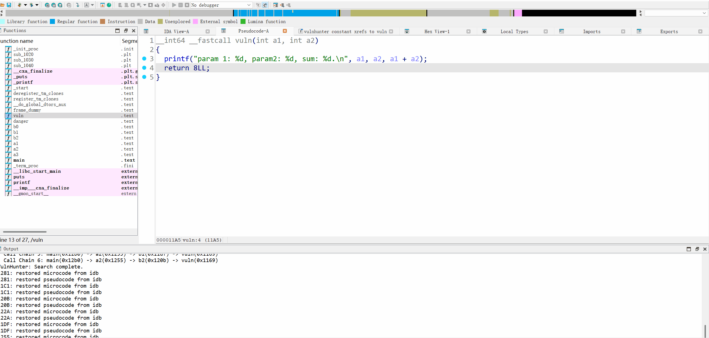
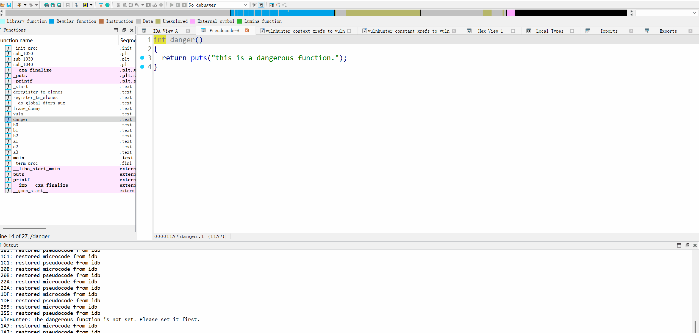

# VulnHunter - IDA Pro 漏洞挖掘辅助插件🛠

**中文** | **[English](https://github.com/ALateFall/vulnhunter)**

`VulnHunter` 是一款为逆向工程师和漏洞研究人员设计的 `IDA Pro` 插件，旨在大幅提升二进制文件漏洞挖掘的**效率**和深度。它通过一系列强大的增强功能，将繁琐的手动分析流程自动化，并基于`MCP`，引入了大型语言模型（LLM）的分析能力，为漏洞挖掘开辟了新的可能性。

**⚠️ 项目状态：** 本项目正在积极开发中。欢迎您通过提交 [Issue](https://github.com/ALateFall/vulnhunter/issues) 或 Pull Request 来为项目贡献力量！

## 🌟 VulnHunter 有什么用🤠？

- **调用链可视化：** 告别手动追踪函数调用，一键高亮从起点到终点的完整调用路径。
- **高级交叉引用：** 超越 IDA Pro 原生功能，实现复杂、可定制的交叉引用查询。
- **LLM 赋能分析：** 集成自定义函数上下文协议（MCP），将强大的 AI 模型引入逆向工程，实现自动化污点分析和危险函数识别。
- **高效快捷键操作：** 精心设计的快捷键，让您在不同的调用链和分析路径之间流畅切换。

## ✨ 主要功能

### 1. 函数调用链高亮😀 (Highlight Call Chain)

在复杂的二进制文件中，手动追溯一个函数的调用来源或最终影响是一项极其耗时且容易出错的工作。`VulnHunter` 彻底改变了这一现状。

- **起点/终点选择：** 只需在反汇编或反编译窗口中选定一个起始函数和一个目标函数。
- **一键高亮：** 插件将自动计算并高亮显示出连接这两个函数的所有可能调用链并将结果输出到`output`窗口。
- **路径切换：** 当存在多条调用路径时，可以通过快捷键 (`Shift+I`) 快速在不同的调用链之间进行切换和预览。


### 2. 高级交叉引用😄 (Advanced Cross-References) 

`IDA Pro` 的原生交叉引用（`Xrefs`）功能强大但相对基础。`VulnHunter` 在此之上构建了一个高级查询引擎，让您能够以更精细、更具语义化的方式筛选交叉引用。

#### 常量参数筛选

有时候，我们希望筛选出那些调用了常量参数的函数的交叉引用，例如`mprotect(addr, length, 7)`中的`7`。`VulnHunter`支持通过高级交叉引用来解决这个问题。通过`VulnHunter`，可以快速找到所有调用某函数时，传入特定常量参数的位置。



#### 上下文函数筛选

`VulnHunter`支持进行基于上下文的交叉引用，可以筛选出调用目标函数的函数中，是否还调用了别的函数。通过设置一个危险函数，即可在交叉引用时筛选出那些调用了该危险函数的交叉引用。



### 3. 自实现 MCP 与 LLM 集成🤖 (Custom MCP for LLM)

通过基于 `fastMCP` 实现的自定义函数上下文协议（`MCP`），我们将 `IDA Pro` 的深度二进制分析能力与大型语言模型（`LLM`）的推理能力无缝结合。

- **功能实现：** 插件将核心的“函数调用链查找”和“高级交叉引用”功能作为 `API` 暴露给` LLM`。
- **自动化污点分析：** 结合 **调用链高亮** 功能，您可以让 `LLM` 作为污点分析引擎。只需告诉 `LLM` 污点源（`Source`）和污点汇（`Sink`），它就能自动调用 `VulnHunter` 的 `API` 来寻找并分析潜在的污点传播路径，实现端到端的全链路漏洞挖掘。
- **智能危险函数识别：** 结合 **高级交叉引用** 功能，LLM 可以自动执行复杂的查询。例如，您可以编写一个 `Prompt`，让 `LLM` 自动去寻找所有调用了 `memcpy` 且其长度参数来自于用户输入的函数，并分析其是否存在缓冲区溢出风险。


目前，`VulnHunter` 实现的 `IDA Pro MCP` 已经实现了如下 `IDA Pro`的接口：

- `get_function_name_by_addr`：通过函数地址获得函数名称。
- `get_function_addr_by_name`：通过函数名称获得函数地址。
- `get_metadata`：获得`IDA`项目的元数据，例如架构、版本、反编译器状态等等。
- `decompile_function`：获得指定地址函数的伪代码。该功能需要`IDA Pro` 的反编译功能存在才可以使用。
- `disassemble_function`：获得指定地址函数的汇编代码。
- `find_call_chain`：找到从起始函数名称到目标函数名称的函数调用链。这是`VulnHunter`的核心功能之一。
- `find_xrefs_with_constant`：查找函数的交叉引用，必须满足包含常量参数。这是`vulnhunter`的核心功能之一。
- `find_context_refs`：查找函数的交叉引用，该交叉引用所在的函数必须还包含了指定的另一个函数。这是`vulnhunter`的核心功能之一。
- `list_import_table_functions`：列出程序的导入表`import_table`中的函数。
- `list_export_table_functions`：列出程序的导出表`export_table`中的函数。

## 🔧 安装与配置

### 前置要求

- **IDA Pro 9.0 或更高版本。**
- **Python 3.11 或更高版本** （建议使用与 IDA Pro 捆绑的版本）。
- (可选，如需使用 LLM 功能) 拥有一个可以调用`MCP`的平台，例如`cline`
- (可选，如需使用 LLM 功能) 拥有一个可用的 `LLM API Key`（如 `OpenAI`,`Anthropic`, 或本地部署的模型 `API`）。

### 安装步骤

1. **下载插件：**

   下载本项目中的两个`py`文件：`vulnhunter.py`和`vulnhunter_mcp.py`。

2. **安装插件：**

   - 将 `VulnHunter.py` 文件和`vulnhunter_mcp.py` 文件一同复制到 IDA Pro 的 `plugins` 目录下。
     - Windows: `IDA Pro\plugins`
     - Linux/macOS: `.idapro/plugins`

3.  （可选，如果需要使用`MCP`）**通过如下命令安装MCP功能：**

```bash
pip install git+https://github.com/ALateFall/vulnhunter.git
```

随后，将如下内容复制到您的`cline`的`mcp`配置：

```json
{
  "mcpServers": {
    "vulnhunter": {
      "disabled": false,
      "timeout": 60,
      "type": "stdio",
      "command": "vulnhunter"
    }
  }
}
```

## 🚀 使用指南

1. 启动 IDA Pro 并加载您的目标文件。
2. （可选，如果需要使用`MCP`）打开您的`MCP`平台，例如`cline`。`VulnHunter`会自动将`MCP`连接到您的平台。（可能需要刷新一下该`mcp`）
3. 根据您的需求使用相应的功能：
   - **调用链高亮:** 在反汇编窗口中，右键起始函数的起始位置选择 `VulnHunter:CallChain/set as start address`，再右键点击目标函数选择 `VulnHunter:CallChain/set as target address`。在两个地址都选择完毕后，右键选择`VulnHunter:CallChain/start to find call chains`。此时`output`窗口将输出所有调用链。使用`Shift+i`可以切换高亮的调用链。
   - **高级交叉引用:** 对于常量参数函数的筛选，对函数使用鼠标右键，使用`VulnHunter:Xrefs/find xrefs with constant values`即可筛选出那些拥有常量参数的函数。使用快捷键`ctrl+x`也有同样的效果。对于上下文函数筛选，使用`vulnhunter:Xrefs/set danger function`设置危险函数，随后即可通过`vulnhunter:Xrefs/find context xrefs`来查找那些同时调用了危险函数和目标函数的交叉引用。

## 🤝 如何贡献

我们热烈欢迎来自社区的任何贡献！无论您是提交 Bug 报告、功能建议还是直接贡献代码，都将对本项目产生积极影响。

## 📜 开源许可

本项目采用 [MIT License](https://github.com/ALateFall/vulnhunter/blob/master/LICENSE) 开源许可。

------

**免责声明：** 本工具仅供授权的安全研究和教育目的使用。使用者应对其行为负全部责任。